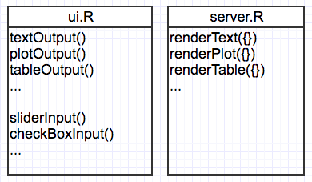

```{r setup, include=FALSE}
knitr::opts_chunk$set(echo = FALSE)
```


## Parts of the app


1. ui.R (Web Graphical user interface, looks good.) 
2. server.R (backend, does the work) 
3. global.R (globally available objects) (optional)

**=> Implementation tasks**

- sketch / plan app (mockup)
- write ui.R (implement mockup)
- write server counterparts / functions
- prepare data

## Input & Output, Processing



## Organizing the dashboard: shinydashboard 


```{r,eval=FALSE,echo=TRUE}
library(shinydashboard)
dashboardPage(
  dashboardHeader(),
  dashboardSidebar(),
  dashboardBody()
)
```

## The dashboardHeader

```{r,eval=FALSE,echo=TRUE}
# width is optional
dashboardHeader(title = "BOAR!",
                  titleWidth = 100)
```


## The dashboardSidebar

```{r,eval=FALSE,echo=TRUE}
dashboardSidebar(
  sidebarMenu(
    menuItem("Overview", tabName = "overview",
             icon = icon("home")),
    menuItem("Download data",
             tabName = "download",
             icon = icon("download"))
),
HTML("<br />"),
  textOutput("time",inline = T),
  width = 280)
)
  
```

## The dashboardBody

```{r,eval=FALSE,echo=TRUE}
dashboardBody(
  tabOverview,
  tabDownload
)

# define tabs else where, they're just lists
```

## Tab defintion example

```{r,eval=FALSE,echo=TRUE}
tabOverview <- tabItem(tabName = "overview",
                       fluidRow(
                         box(title = "KOF Barometer",
                             dygraphOutput("dykofbaro"),
                             width = 12,solidHeader = T,
                             status = "primary",
                             collapsible = TRUE)
                       )
)
```


